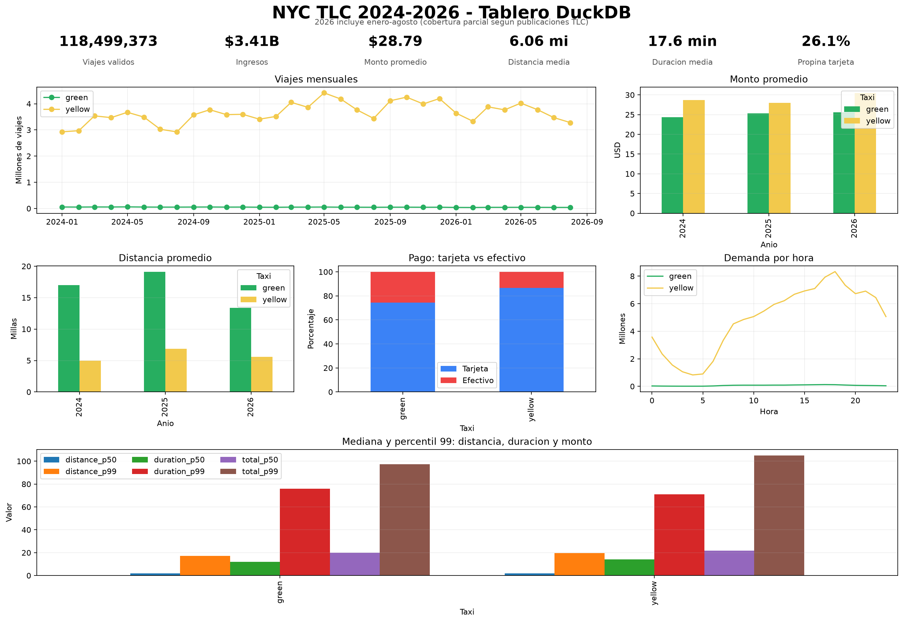

# Resultados reproducibles

Generado por `python scripts/run_analysis.py` directamente sobre los Parquet disponibles.
El anio 2026 es parcial: solo se incluyen los meses publicados por la TLC a la fecha de ejecucion.

## Cobertura y volumen

| taxi_type | file_year | files | rows     |
| --------- | --------- | ----- | -------- |
| green     | 2024      | 12    | 660218   |
| yellow    | 2024      | 12    | 41169720 |
| green     | 2025      | 12    | 591375   |
| yellow    | 2025      | 12    | 48722602 |
| green     | 2026      | 8     | 337114   |
| yellow    | 2026      | 8     | 29703355 |

## Calidad de datos

Las categorias pueden solaparse; para los indicadores se usa `valid_trips`, que filtra fechas fuera del anio del archivo, duraciones no positivas o mayores de 24 horas, distancias negativas y montos negativos.

| taxi_type | file_year | rows     | null_timestamps | pickup_outside_file_year | nonpositive_duration | duration_over_24h | nonpositive_distance | negative_total | missing_or_zero_passengers |
| --------- | --------- | -------- | --------------- | ------------------------ | -------------------- | ----------------- | -------------------- | -------------- | -------------------------- |
| green     | 2024      | 660218   | 0.0             | 20.0                     | 662.0                | 0.0               | 34574.0              | 2174.0         | 31121.0                    |
| yellow    | 2024      | 41169720 | 0.0             | 56.0                     | 13510.0              | 230.0             | 776305.0             | 609344.0       | 4492586.0                  |
| green     | 2025      | 591375   | 0.0             | 21.0                     | 1910.0               | 2.0               | 24438.0              | 1774.0         | 58135.0                    |
| yellow    | 2025      | 48722602 | 0.0             | 29.0                     | 546304.0             | 352.0             | 1402958.0            | 973721.0       | 11871956.0                 |
| green     | 2026      | 337114   | 0.0             | 14.0                     | 234.0                | 4.0               | 12212.0              | 1023.0         | 53302.0                    |
| yellow    | 2026      | 29703355 | 0.0             | 17.0                     | 371683.0             | 263.0             | 952231.0             | 161835.0       | 7808047.0                  |

## Hallazgos

1. El mayor volumen mensual observado fue **4,415,006 viajes** para taxis **yellow** en **2025-05**.
2. La hora con mas registros agregados fue **18:00** para taxis **yellow** (8,328,983 viajes). Esto concentra capacidad operativa y no implica causalidad.
3. La relacion de volumen amarillo/verde fue **2024: 61.7x, 2025: 80.3x, 2026: 86.9x**. La diferencia confirma que comparar solo conteos absolutos puede ocultar patrones propios del servicio verde.
4. El monto promedio evoluciono asi: **2024: amarillo $28.67, verde $24.39, 2025: amarillo $28.00, verde $25.34, 2026: amarillo $30.44, verde $25.62**. El aumento de 2026 debe interpretarse con cautela porque el anio es parcial.
5. En taxi verde la distancia mediana fue **1.95 mi** y el percentil 99 **17.26 mi**, mientras la media anual supera ampliamente la mediana. Esta asimetria revela valores extremos y desaconseja interpretar solo promedios.
6. Existen registros invalidos (tabla de calidad); por ello el tablero separa la vista cruda `trips` de la vista analitica `valid_trips`.

## Indicadores

Los archivos CSV en `docs/results/` respaldan: viajes, ingresos, monto medio, distancia media, duracion media, porcentaje de propina con tarjeta, participacion de fin de semana, mezcla de pago, demanda por hora y percentiles de valores relevantes.

